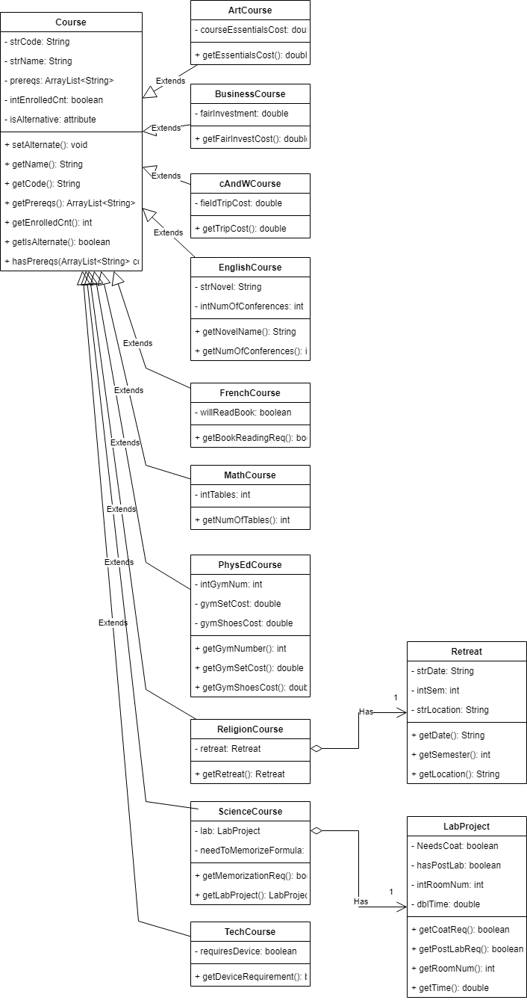

# ICS4U OOP Assignment

## Class Diagram
 

 

## Summary

#### This project is designed to utilize object-oriented programming to perform the initial examination of a grade 12 student's course selection. Some aspects of a course selection process, however, have been looked over and are next steps for the improvement of this project. 

 

#### Some factors that are checked by this project include:
    - check if prerequisites for planned courses have been earned
    - check if student has a religion/philosophy course planned or if they have a religion exemption
    - check if an English course has been planned
    - check if enough credits will be earned by the end of the upcoming year

#### Examples of future improvement can be providing the student with a timetable and expanding the code to work for all grades.

